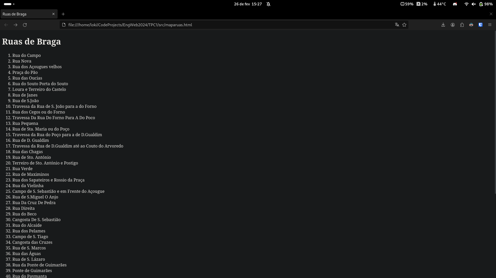
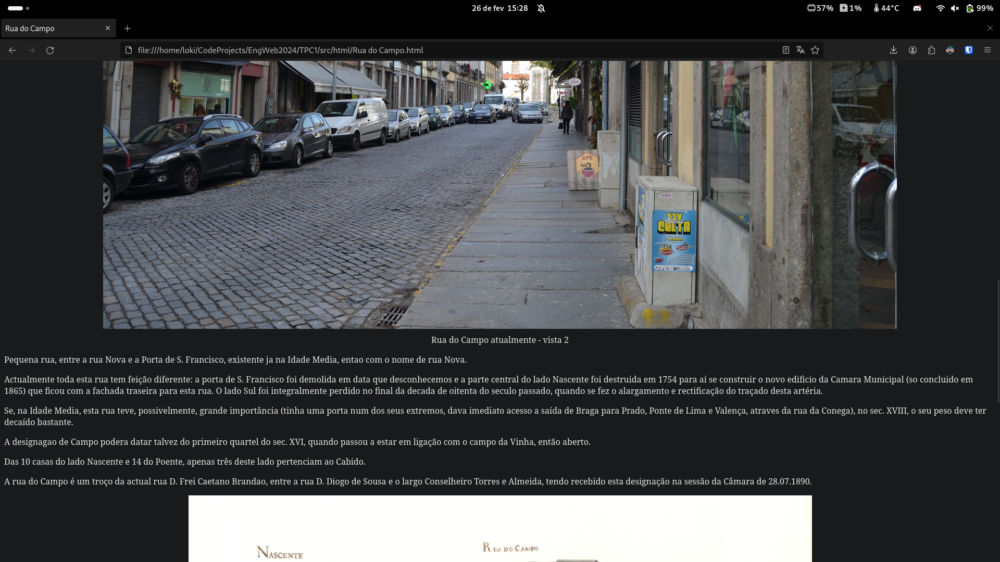
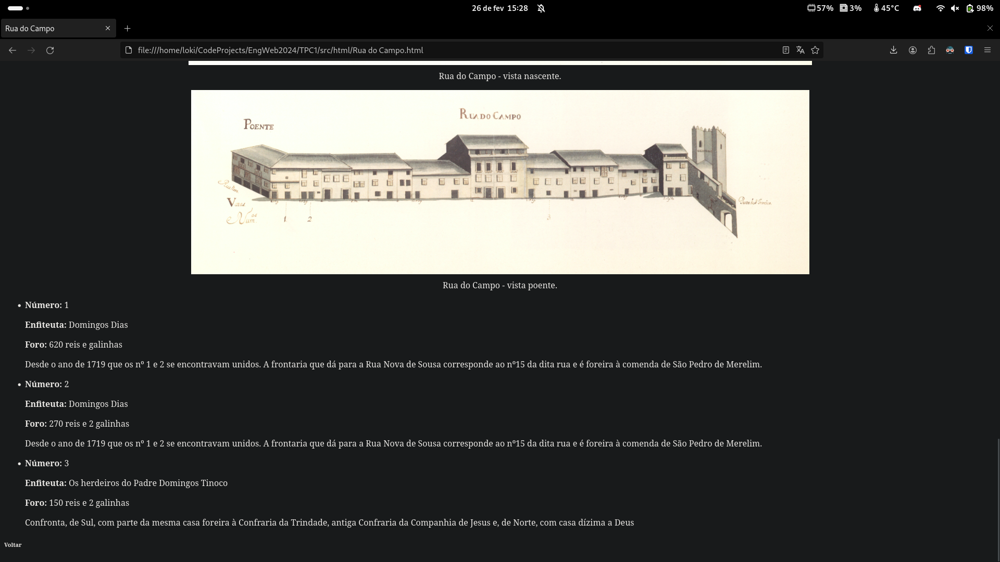

# Engenharia Web 23/24 - TPC1

**Engenharia Informática - Universidade do Minho** 

## Objetivo
Criar uma página estática com um índice ordenado das várias ruas de Braga e uma página html para cada rua respetivamente.

## Material
[Aqui](https://epl.di.uminho.pt/~jcr/AULAS/EngWeb2024/semana1/MapaRuas-materialBase.zip) encontra-se um ficheiro .zip com o material necessário para a realizacão do TPC.

## Desenvolvimento
Para a execução deste projeto, criei um pequeno script em pyhton que integra os vários ficheiros.xml e cria todas as páginas html necessárias. Decidi utilizar a biblioteca *xml.etree.ElementTree* para procurar facilmente a informação relevante para a construção da página html de cada Rua.

## Resultados Obtidos

