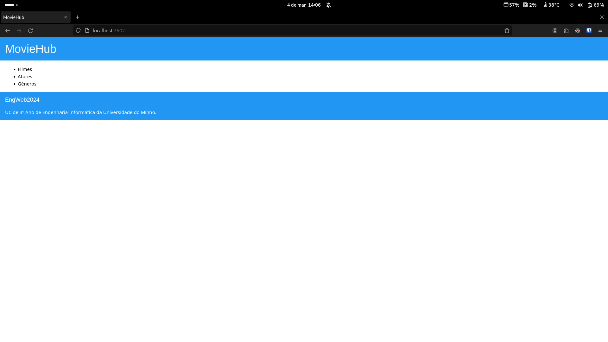
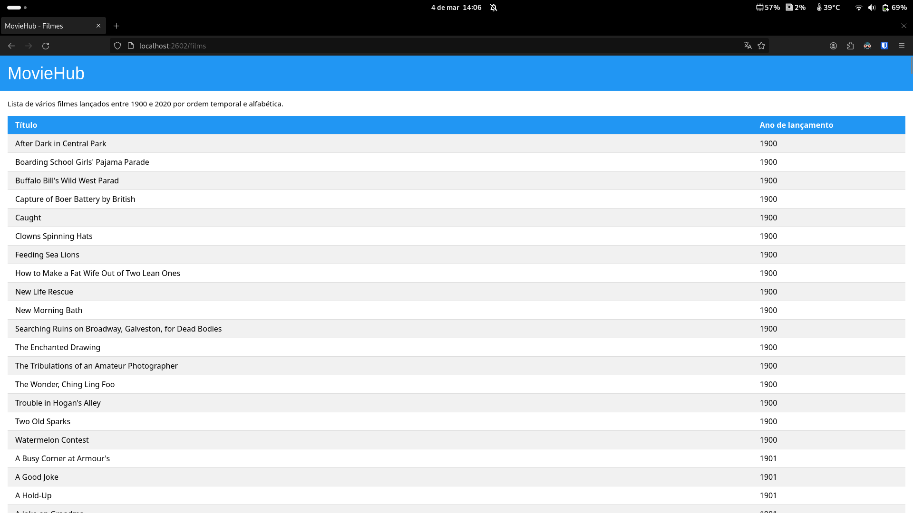

# Engenharia Web 23/24 - TPC2

**Engenharia Informática - Universidade do Minho** 

## Objetivo

## Material
[Aqui](https://elearning.uminho.pt/bbcswebdav/pid-1437448-dt-content-rid-8024416_1/xid-8024416_1) encontra-se o dataset necessário para a realizacão do TPC.

## Desenvolvimento

## Resultados Obtidos

